# Лабораторная работа №6: Система контроля версий
**Студент**: Огнев Илья

**Группа**: 4314

# Описание работы
Цель лабораторной работы: изучение базовых возможностей системы управления версиями, опыт работы с Git Api, опыт работы с локальным и удаленным репозиторием.


# Содержание
1. [Копирование репозитория](#fork-repository)
2. [Настройка клиента Git](#client-settings)
3. [Клонирование своего репозитория на компьютер](#clone-repository)
4. [Добавление файла через интерфейс GitHub](#Adding-file)
5. [Получение историю операций для каждой из веток](#take-history)
6. [Просмотреть последние изменения](#looking-last-history)
7. [Слияние в ветку master с разрешением конфликта](#checkout)
8. [Удаление побочной ветки после слияния](#delete-branch)
9. [Сделать изменения и зафиксировать их несколько раз](#editing-n-fixing)
10. [Сделать откат коммита](#reverting)
11. [Создать ветку для отчёта](#checkout-branch)
12. [Получить историю операций в форматированном виде](#take-history-last)


<a name="fork-repository"></a>
# Копирование репозитория
1. Переходим по ссылке: [LR6 репозиторий](https://github.com/Kurtyanik/LR6/).
2. Нажимаем кнопку "Fork" (это скопирует данный репозиторий в наш личный аккаунт GitHub).

   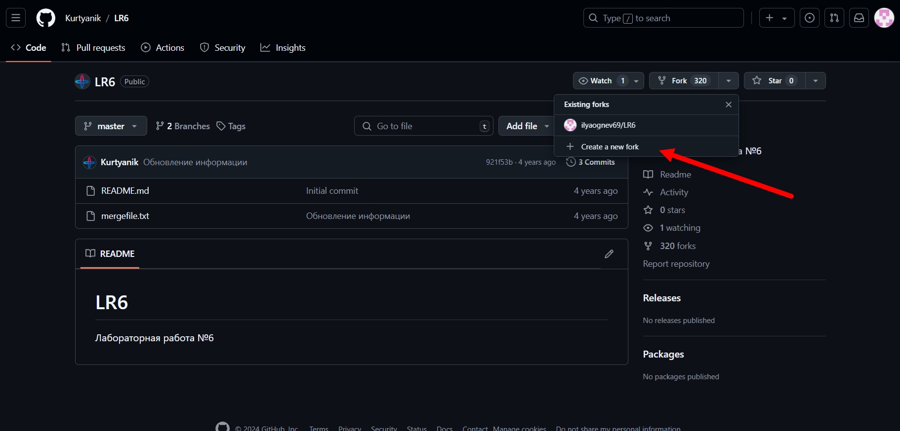


<a name="client-settings"></a>
# Настройка клиента Git
1. Откроем командную строку или терминал (Windows: PowerShell, Linux/Mac: терминал).
2. Введем следующие команды для настройки имени пользователя и email:

```bash
git config --global user.name "4314 Огнев И.Д."
git config --global user.email "ilyaognev69@gmail.com"
```

Эти данные будут использоваться для идентификации автора коммитов.


<a name="clone-repository"></a>
# Клонирование своего репозитория на компьютер
1. Найдем наш форкнутый репозиторий на нашем GitHub аккаунте.
2. Нажмем кнопку "Code" и скопируем ссылку для клонирования (HTTPS или SSH).
3. В терминале выполним команду:

```bash
git clone <скопированная_ссылка>
```

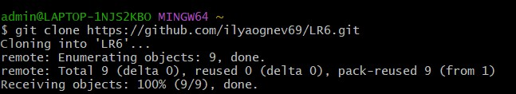

Это скопирует удалённый репозиторий на наш компьютер.


<a name="Adding-file"></a>
# Добавление файла через интерфейс GitHub
1. Перейдем в наш репозиторий на GitHub.
2. Нажмем на "Add file" -> "Upload files" и добавим новый файл (например, test.txt).
3. В терминале на компьютере выполним команду для подтягивания изменений:

```bash
git pull
```

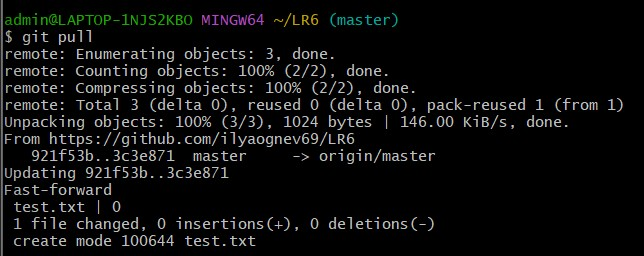

Это обновит наш локальный репозиторий новыми изменениями.


<a name="take-history"></a>
# Получение историю операций для каждой из веток
В терминале выполним команду:

```bash
git log --oneline --all --graph
```

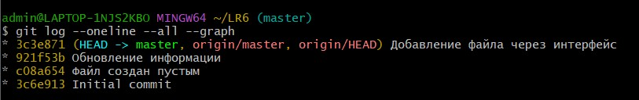

Это покажет историю коммитов с сокращёнными хэшами для всех веток.


<a name="looking-last-history"></a>
# Просмотреть последние изменения
Выполним команду:

```bash
git log -1
```

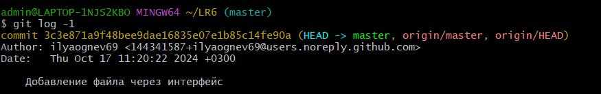

Это покажет информацию о последнем коммите.


<a name="checkout"></a>
# Слияние в ветку master с разрешением конфликта
Переключимся на ветку master:

```bash
git checkout master
```

Выполним команду слияния:

```bash
git merge <имя_ветки>
```

Если возникнут конфликты, откройем конфликтующие файлы в любом редакторе (например, VS Code), разрешим конфликты и зафиксируем изменения:

```bash
git add .
git commit
```

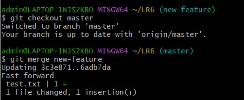


<a name="delete-branch"></a>
# Удаление побочной ветки после слияния
После успешного слияния выполним команду для удаления ветки:

```bash
git branch -d <имя_ветки>
```

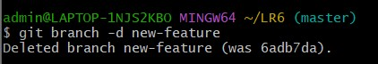


<a name="editing-n-fixing"></a>
# Сделать изменения и зафиксировать их несколько раз
1. Внесем изменения в несколько файлов или один файл несколько раз.
2. Зафиксируйем изменения с комментариями:

```bash
git add .
git commit -m "Комментарий к изменению"
```

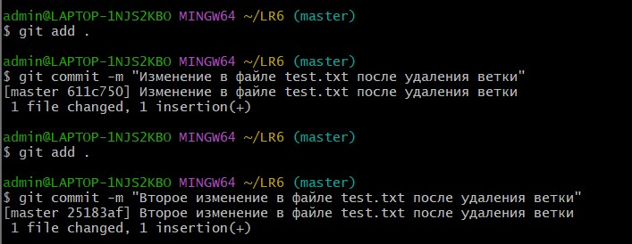


<a name="reverting"></a>
# Сделать откат коммита
Выполним откат коммита с помощью команды:

```bash
git revert <хэш_коммита>
```

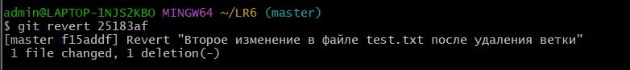

Это создаст новый коммит с изменениями, которые отменяют указанный коммит.


<a name="checkout-branch"></a>
# Создать ветку для отчёта
Создадим новую ветку:

```bash
git checkout -b report
```

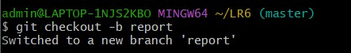


<a name="take-history-last"></a>
# Получить историю операций в форматированном виде
Выполним команду:

```bash
git log --pretty=format:"%h %ad %an %s" --date=short
```

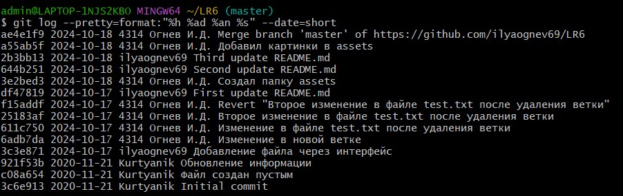
